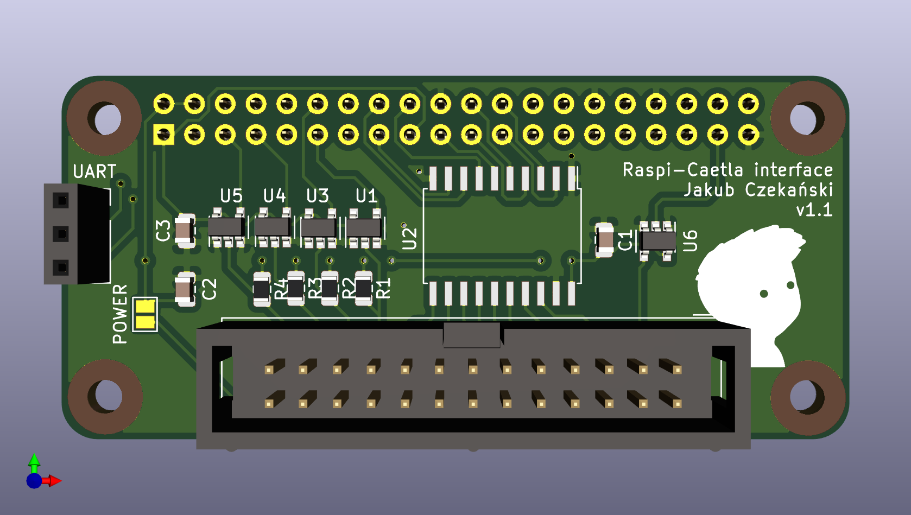
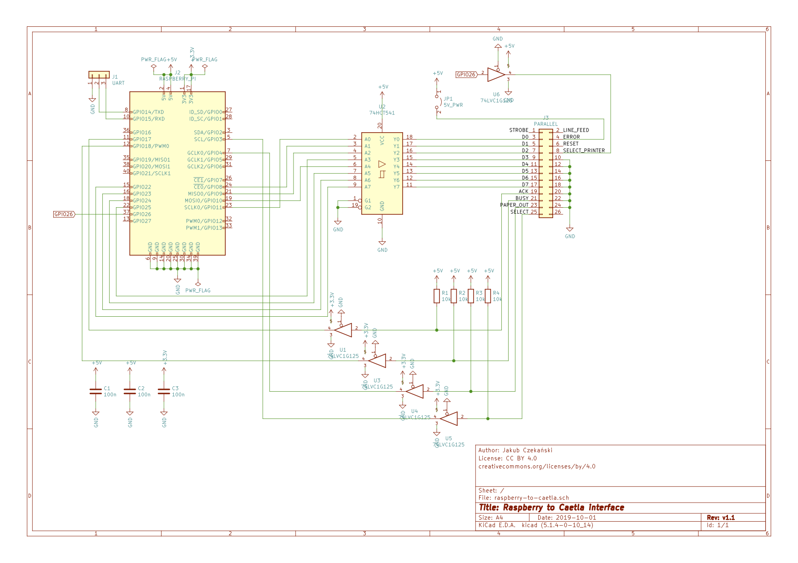

# Raspberry PI Zero to Caetla (Xplorer) interface

Adapter for [Xplorer PS1 cartridges](https://github.com/simias/rustation/wiki/Xplorer-FX-setup) (for use with [catflap4linux](https://github.com/hkzlab/catflap4linux))

Author: Jakub Czekański

License: [CC BY 4.0](https://creativecommons.org/licenses/by/4.0)

